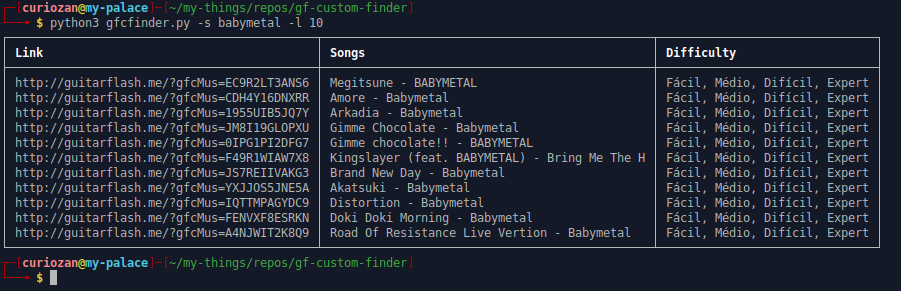

# GF Custom Finder

`gf-custom-finder` is a python script to help search guitar flash custom song listed in [Guitar Flash Custom](https://www.guitarflash.com/custom/lista.asp)


## Features

1. Search by any keyword. You can use song title or band
2. Omit duplicate search result
3. Limit search output

## Installation

Install the python library requirement

```
pip3 install -r requirements.txt
```

## Usage

You can simply just run script like this. The keyword is `not case sensitive`. So, if you type `bmth` and `BMTH` the result is same.

```
python3 gfcfinder.py -s <your keyword>
python3 gfcfinder.py -s <your keyword> -l <limit output>
```

example:

```
python3 gfcfinder.py -s babymetal -l 10
```

